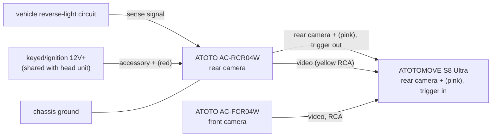
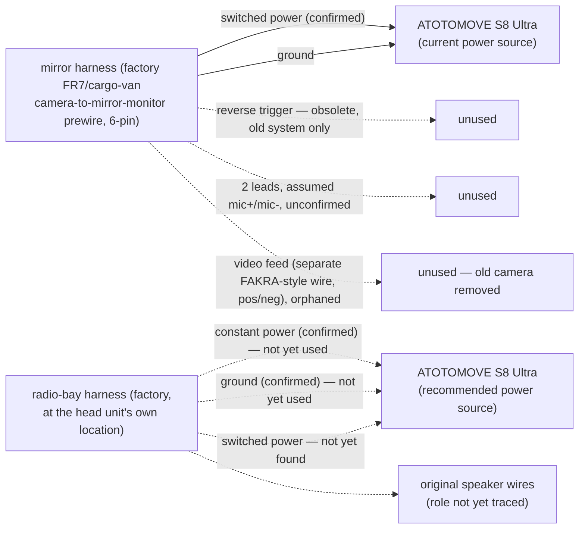
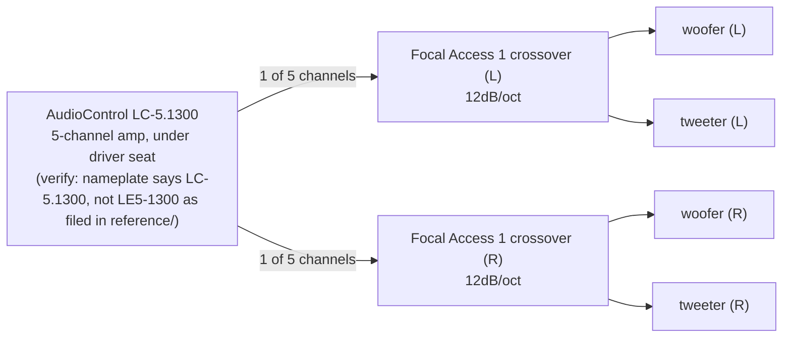

# audio plan

last updated: 2026-10-07

one section per subsystem, each leading with its diagram, then an installation checklist (ordered, check off as done), then a supplies checklist (`[x]` in hand, `[ ]` still needed). open questions that anchor to one specific line are tagged inline as `(verify: ...)`; ones that don't are in "open questions" at the end. rejected or settled-either-way design alternatives are in "decided" at the end, so they don't get re-proposed.

## camera wiring

### installation

- [x] mount and wire the head unit (ATOTOMOVE S8 Ultra)
- [x] mount and wire the front-facing camera (ATOTO AC-FCR04W) — video to head unit
- [x] mount and wire the rear-facing camera (ATOTO AC-RCR04W), replacing the stock rear camera
- [x] rear camera accessory + (red) → keyed/ignition power source, same one the head unit uses
- [x] rear camera video (yellow male RCA) → head unit rear camera input (yellow female RCA)
- [x] rear camera chassis ground → established
- [x] rear camera backup-lamp wire → vehicle reverse-light circuit → established
- [x] rear camera "rear camera +" (pink) → head unit "rear camera +" (pink) — confirmed this is the camera's own trigger output telling the head unit to switch display, not a raw pass-through of the reverse-light circuit; power for the camera comes from the accessory + wire above instead, so there's no current-starvation risk on this signal path
- [ ] **troubleshoot known issue**: camera displays briefly on reverse, then drops. since the camera's real power is the robust keyed+ feed (not the reverse-light wire), this is no longer suspected to be a power/voltage-sag problem — more likely the backup-lamp sense signal itself isn't holding steady for the full time in reverse. check in this order: (1) watch the actual exterior reverse lamp while held in reverse — if it flickers, the problem is upstream in the vehicle's reverse-light circuit or transmission switch, not this install; (2) inspect the backup-lamp wire's splice — if it's a quick-splice/vampire-tap connector, redo it as a soldered or crimped, heat-shrunk joint; (3) measure voltage at that wire for the full duration of a sustained reverse engagement, confirm it holds steady near 12V rather than sagging or dropping; (4) check the camera's chassis ground connection quality — a marginal ground can make a sense input read erratically right at its threshold
- [ ] if the above all checks out solid and it still flickers: add a relay so the backup-lamp wire only triggers the relay coil (85/86), while the relay's switched output (87, fed from the same robust keyed+ source via pin 30) feeds the camera's backup-lamp sense input instead of the raw factory wire directly — gives the camera a clean signal regardless of what the factory circuit is actually doing
- [ ] confirm the rear camera now stays on steadily for the full duration of reverse, not just the first moment

### supplies

- [x] [ATOTOMOVE S8 Ultra head unit](https://www.amazon.com/dp/B0FCXLPTCB), 10.1" — android head unit, wireless carplay/android auto
- [x] [ATOTO AC-FCR04W front camera](https://www.amazon.com/dp/B0DKT4XJXS), 1080P, 150° FOV
- [x] [ATOTO AC-RCR04W rear camera](https://www.amazon.com/dp/B0DK6LDBSM), 1080P HDR, 145° FOV, IP67 — replaced the stock rear camera
- [x] [Gebildet 2-pack 40/30A relay harness kit](https://www.amazon.com/dp/B07TWC48QW), 4-pin SPST — wire colors: white=86 (trigger), black=85 (ground), red=30 (power in), blue=87 (switched output) — only needed if the troubleshooting above points to the relay fix
- [x] salvaged OEM 12V 30A relay (used previously for the stock camera) — alternative to the Gebildet kit above; its 4 wires aren't color-coded, identify the 85/86 coil pair vs. the 30/87 switch pair with a continuity check (relay unplugged from its socket): the pair showing ~50-120 ohms resistance is the coil (85/86, either wire either way); the pair showing open circuit is the switch (30/87, either wire either way). photos: [housing back, embossed part number](../reference/IMG_1713.jpeg), [pin diagram face — 30/86/87/85, 12V 30A](../reference/IMG_1711.jpeg), [socket with its 4 uncolored wires](../reference/IMG_1712.jpeg)
- [ ] inline fuse holder + small fuse (1-3A likely, confirm against actual camera draw) for the relay's pin-30 feed — **not included with either relay above**, confirmed by physical inspection

## head unit power source

the head unit's accessory power, ground, and old camera video feed all currently come from a single harness behind the rearview mirror — not a dedicated run. investigated 2026-10-07; a proper factory source was found separately and this section documents moving to it.

### installation

- [x] traced the mirror-area harness: 6-cavity connector, matches the documented Mercedes factory FR7/cargo-van rearview-camera-to-mirror-monitor prewire (6-pin connector A221 545 01 28 per an [official Mercedes-Benz upfitter bulletin](https://www.mbvans.com/content/dam/mb-vans/us/upfitter/bulletins/sprinter-retrofitting-rear-view-camera.pdf)) — power, ground, reversing/video-release signal, and microphone pins, with video carried separately over a FAKRA-style connector rather than through this block. [photo](../reference/IMG_1715.jpeg)
- [x] identified and tested the wires in this harness: power wire confirmed **switched** (drops to 0V with ignition off — matches the documented "Kl. 15" ignition-switched designation, corrects an earlier read of "constant"); ground wire confirmed; reverse-trigger wire confirmed (this is the old system's trigger path, separate from and now superseded by the new rear camera's own trigger output — see "camera wiring" above)
- [x] the 2 remaining wires in this harness, left cropped but uncapped by the original aftermarket install, assumed to be the mic+/mic- leads for a factory mirror-mounted microphone (per the documented connector's pin list) — **not confirmed**, assumption only (verify: continuity/voltage check to confirm before relying on this)
- [x] the single independently-routed wire hanging near this harness identified as the video feed line (FAKRA-style, functions as a signal/return pair) — this fed the factory rear camera's video to the mirror monitor originally, then was intercepted by the old aftermarket install to feed the old head unit instead. now orphaned: the new rear camera has its own direct RCA run to the new head unit (see "camera wiring" above), so this wire isn't needed for anything
- [x] separately found a second harness at the head unit's own mounting location (not the mirror) — consistent with a normal factory radio harness, contrary to an initial "radio-delete" concern: red wire with black stripe confirmed **constant** power; brown wire confirmed ground; original factory speaker wires also present (role not yet traced — may be feeding the AudioControl amp's speaker-level inputs rather than the amp taking RCA from the head unit, worth tracing before deciding how the new head unit should connect to the existing amp)
- [x] cross-checked the radio-bay findings against two independent Mercedes Sprinter factory radio harness references ([the12volt.com, 2010 Sprinter 2500](https://www.the12volt.com/installbay/forum_posts.asp?tid=145518), [modifiedlife.com, 2013 Sprinter](https://www.modifiedlife.com/2013-mercedes-benz-sprinter-stereo-wiring-diagram/)) — both independently give **red with a black stripe** for constant power and **brown** for ground, exactly matching what was found and tested here. the two sources disagree on switched power: the 2010 reference says the factory harness has none at all (must be sourced separately); the 2013 reference gives **red with a dark green stripe**. full documented color key, for validating every wire in this harness: constant = red/black; ground = brown; switched (2013 only, unconfirmed for this van) = red/dark green; antenna trigger = yellow/black; illumination/dimmer = gray/blue; speakers (all brown-based) — LF +/- = brown/purple, brown/dark-green; RF +/- = brown/orange, brown/dark-blue; LR +/- = brown/red, brown/white; RR +/- = brown/pink, brown/gray
- [ ] **validate the full color key above against the actual harness**, one wire at a time: confirm the already-tested constant (red/black) and ground (brown) still match; look specifically for a red/dark-green wire as the switched-power candidate (if present, that resolves the switched-power search; if genuinely absent, treat this van as matching the 2010 reference — no factory switched wire here — and source switched power from the fuse box instead); check for a yellow/black antenna wire and a gray/blue illumination wire, noting whether either is present and what they actually do when tested; match each of the "original speaker wires" found here against the 4-channel color key (brown/purple, brown/dark-green, brown/orange, brown/dark-blue, brown/red, brown/white, brown/pink, brown/gray) to identify which channel each one is, rather than tracing them blind
- [ ] trace the red-with-black-stripe constant-hot wire at the radio bay back to its origin — confirm it's a properly fused factory circuit (and what else, if anything, shares it) before relying on it as the head unit's memory-power source
- [ ] re-wire the head unit's power and ground from the mirror harness to the radio-bay harness (constant + switched once found + ground) — the radio-bay harness is sized for an actual head unit's draw; the mirror harness was sized for a small mirror-mounted display and has been running the whole head unit, which it probably isn't rated for
- [ ] once the head unit is moved off it, cap the mirror harness's power/ground/trigger/mic/video wires and leave the factory circuit intact but disconnected from the aftermarket system — nothing currently needs it
- [ ] once the speaker wires are identified by channel (above), confirm whether they feed the AudioControl amp's speaker-level inputs (see "front speakers and amplifier" below) — determines whether the new head unit should drive those same wires or whether the amp should be reconfigured to take RCA from the new head unit's preamp outputs instead

### supplies

no new parts needed — this is a rewiring task using sources already present in the vehicle.

## front speakers and amplifier

existing system, pre-dating this project — documented as-built, no install work pending.

### installation

- [x] AudioControl LC-5.1300 amp mounted under the driver seat (shares the under-seat cavity with the starter battery and the electrical/ subsystem's van-feed wire — routing constraint already noted there)
- [x] 2x Focal Access 1 crossovers wired — one channel in from the amp per side, internally split to woofer and tweeter outputs. [photo](../reference/IMG_1714.jpeg)
- [x] front woofer + tweeter pairs (L and R) wired from each crossover's outputs

### supplies

- [x] AudioControl LC-5.1300, 5-channel (4x 100W + 1x 300W @ 4-ohm), independent 12dB/octave Linkwitz-Riley crossovers per channel (verify: nameplate/model number — see diagram note). spec source: [official AudioControl quick-start guide](https://archive.audiocontrol.com/downloads/car/current/lc-51300/lc-51300-qsg.pdf); the on-file photo is [reference/audiocontrol-LE5-1300-UM11225.heic](../reference/audiocontrol-LE5-1300-UM11225.heic)
- [x] 2x Focal Access 1, 12dB/octave passive crossover, 2-way (woofer/tweeter)
- [x] front woofer + tweeter pairs, L and R (specific model: not yet recorded)

## open questions

- the rear camera's actual current draw — needed to size the relay's fuse correctly, if the relay fix ends up being needed
- which harness pin/wire color carries the REV trigger signal on this specific S8 variant, and whether this matters now that the pink wire is confirmed to be camera-to-head-unit, not vehicle-to-head-unit directly
- **front speakers, active-crossover upgrade (deferred, pursue later)**: the AudioControl LC-5.1300 amp (see "front speakers and amplifier" below) has independent 12dB/octave crossovers built into its own 5 channels, same slope as the Focal Access 1 passive crossovers currently in place. since only 2 of its 5 channels are used right now (one per side, feeding each Focal crossover's single input), there's likely enough spare capacity to run the front woofers and tweeters on independent channels (4 total) with the amp doing the frequency split electronically, freeing the passive crossovers — plus the 5th channel still available for a sub. this is a real rewiring project (new amp-to-driver runs per channel, reconfiguring the amp's onboard crossover points), not a quick change, and isn't needed for anything to keep working — the current passive setup is correct and complete as-is.

## decided

- going active on the front speakers isn't required by the new head unit — its DSP doesn't change what the passive Focal crossovers are doing, and removing them without independent per-driver amplification would send full-range signal to the tweeters (likely to damage them quickly) and highs to the woofers. the existing passive crossovers stay in place unless/until the active upgrade above is actually pursued.
