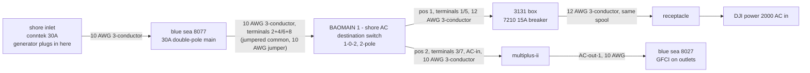
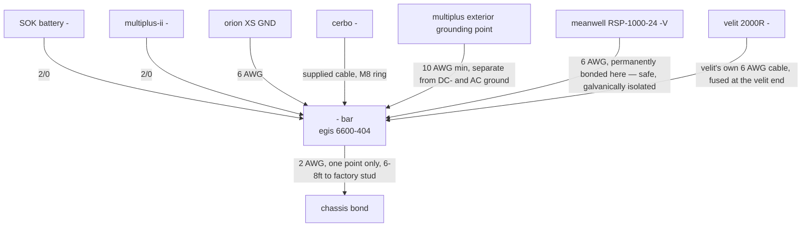
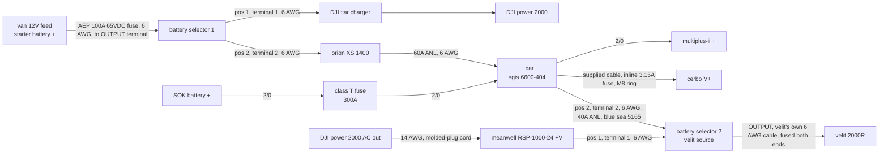
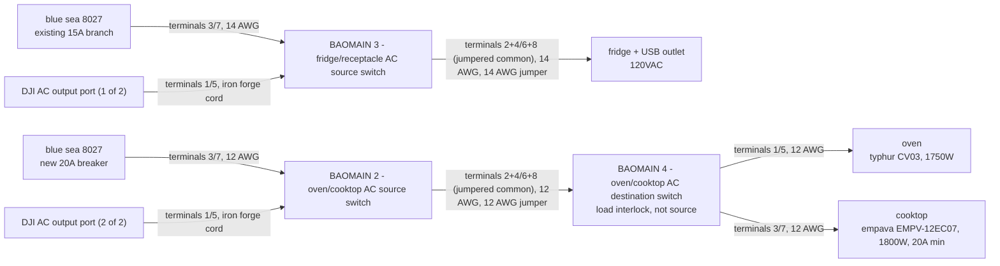
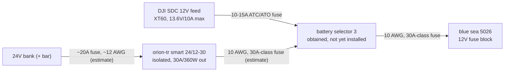
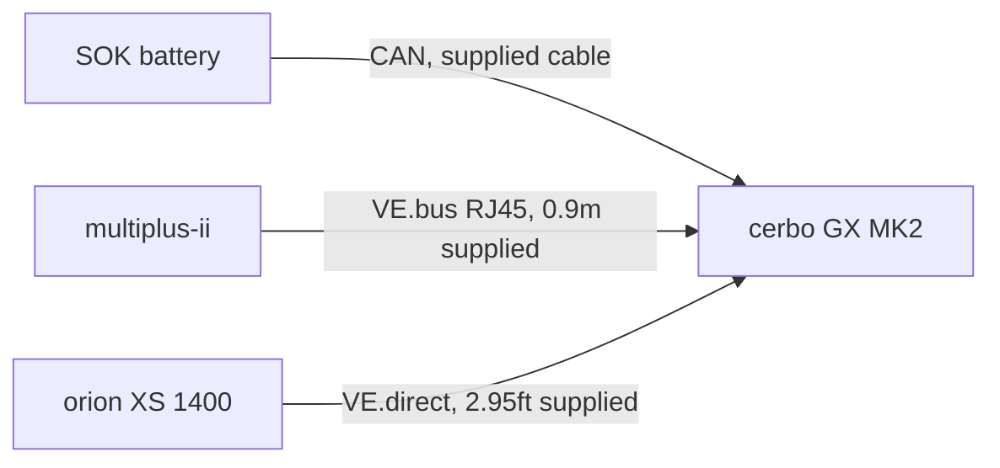

# electrical plan

last updated: 2026-10-03

one section per subsystem (matching the diagrams below), each leading with its diagram, then an installation checklist (ordered, check off as done), then a supplies checklist (`[x]` in hand, `[ ]` still needed). a returned item is removed from its supplies list entirely, not kept as a checked-off line. cable lengths and reel-sharing notes are inline on the relevant installation/supply line, not a separate table. open questions that anchor to one specific line are tagged inline as `(verify: ...)`; ones that don't are in "open questions" at the end. rejected or settled-either-way design alternatives are in "decided" at the end, so they don't get re-proposed. for the full history of how any of this got decided, `git log` is the change log — every change here has a commit message. for what's actually confirmed built, see README.md.

sections are ordered to match the real install sequence: ac input, then the DC backbone (negative before positive — that's the system's only ground reference and it goes in first), then the alternator and velit (part of dc positive and alternator), then the kitchen AC loads, then the 12V bus, then data cables last.

## tools required

- [x] DxCRIMP hex ferrule crimper, AWG 24-4
- [x] ferrule set, 166pc, AWG 1/0-12
- [x] pro'skit 902-160 crimpro crimper, AWG 2-4-6 — for 6/4/2 AWG screw terminals
- [x] [IWISS battery cable lug crimping tool kit](https://www.amazon.com/IWISS-Battery-Crimping-Terminals-Stripper/dp/B09PYH9B4Q), AWG 8-4/0 — for the 2/0 ring lugs
- [ ] adhesive heat shrink
- [x] cable cutter
- [x] inch-pound torque wrench
- [x] multimeter
- [ ] 1-1/8" hole saw

## conventions

**switch position convention** (2026-09-21): position 1 is always the DJI leg, position 2 is always the victron leg, on every switch that splits between the two systems (BAOMAIN 1, BAOMAIN 2, BAOMAIN 3, battery selector 1, battery selector 2, battery selector 3). matches the physical layout — DJI mounted driver side/left, victron gear passenger side/right — so turning a switch left (position 1) selects DJI and right (position 2) selects victron. exception: BAOMAIN 4 selects between two *loads* (oven/cooktop), not two sources, so this convention doesn't apply to it — which appliance sits on which leg is arbitrary.

**BAOMAIN transfer-switch terminal wiring**: jumper terminal 2 to terminal 4 (common hot) and terminal 6 to terminal 8 (common neutral) to turn the switch's two independent contact pairs into one proper double-throw. terminal 1/5 is the "position 1" leg; terminal 3/7 is the "position 2" leg. ground never goes through the switch — bond all grounds together directly. terminal is M4 screw, accepts 2.5-6.0mm² wire (about 14-10 AWG), torque 1.2 N·m. each switch's specific terminal assignment is in its own category's installation checklist below. verify with a continuity meter before energizing — BAOMAIN's own manual doesn't spell out this transfer-switch application, though the jumper pattern matches the manual's own truth table.

**AC wiring is the dangerous part of this build — have it inspected before energizing anything past the inlet, especially the BAOMAIN switches.**

## ac input

### installation

- [x] mount the shore inlet, blue sea 8077, BAOMAIN 1, and the multiplus (shore power disconnected throughout)
- [ ] wire inlet → 8077 → BAOMAIN 1 common, 10 AWG 3-conductor throughout (10ft max on the inlet-to-8077 leg — 15ft southwire SOOW cord on hand; verify: if this leg ever needs to be longer, blue sea's 8027-family manual says an additional fuse/breaker is needed within 10ft of the inlet — applied here by analogy, not confirmed for the 8077 specifically)
- [ ] install BAOMAIN 1's jumpers (terminal 2→4, 6→8), 10 AWG. common = 8077 output. pos 1 (terminal 1/5) = 3131/DJI branch, wired later. pos 2 (terminal 3/7) = multiplus AC-in, 10 AWG 3-conductor
- [ ] continuity check: no hot-neutral or hot-neutral-ground continuity anywhere wired so far; confirm position 2 connects it and position 0 opens it
- [ ] **hold here** — do not plug in shore power until the DC backbone (dc negative and ground, dc positive and alternator) is fully wired and the SOK is on
- [ ] set the multiplus's battery profile to lithium, absorption ≤27.6V, via VictronConnect (needs the multiplus powered from the DC backbone above — no cerbo/DVCC yet to do this automatically)
- [ ] plug in shore power; verify with a multimeter (120V hot-neutral, 120V hot-ground, 0V neutral-ground); confirm the reverse-polarity LED is off before energizing any branch circuit
- [ ] multiplus AC-out-1 → 8027, 10 AWG 3-conductor, landing on the 8027's 30A main
- [ ] wire the DJI AC-input branch (deferred): BAOMAIN 1 pos 1 → 3131 box → 7210 15A breaker → receptacle → DJI AC in, 12 AWG 3-conductor (verify: 3131 gland size and how its grounds connect, that the 7210 is single-pole, and the marine/UL rating of this triplex — labeled "marine grade" with no UL/ABYC rating given)
- [ ] continuity check on the DJI AC-input branch before energizing it

### supplies

- [x] victron multiplus-ii 24/3000/70, 120V, 3000VA — main inverter/charger
- [x] blue sea 8077, 30A double-pole main — shore/generator main breaker
- [x] conntek 30A 125V stainless shore inlet
- [x] carlon E987N-3-HD enclosure, 4x4x4in — houses the 8077. [home depot](https://www.homedepot.com/p/Carlon-4-in-x-4-in-x-4-in-Gray-Electrical-PVC-Junction-Box-E987N-3-HD-E987N-3-HD/100404095) (verify: fit against the real 8077, whose 2.63x3.75in footprint came from retailer listings, not an official blue sea manual)
- [x] southwire 10 AWG 3-conductor SOOW cord, 15ft — shore inlet to 8077. [lowe's](https://www.lowes.com/pd/Southwire-10-AWG-3-Black-Power-Cord-By-the-Foot/50148254)
- [x] BAOMAIN 32A cam changeover switch, SZW26-32/D202.2D — BAOMAIN 1, shore AC destination. [amazon](https://www.amazon.com/Baomain-Universal-Changeover-SZW26-32-D202-2D/dp/B09MMQPQQH)
- [x] blue sea 3131 circuit breaker enclosure — DJI AC-input branch
- [x] blue sea 7210, 15A toggle breaker — DJI AC-input branch
- [x] 12 AWG 12/3 triplex marine wire, 20ft — DJI AC-input branch
- [ ] 10 AWG 3-conductor cable — 3 interior AC runs
- [ ] surface-mount outlet box w/ 15A/20A receptacle — DJI AC-input branch
- [x] honda EU2200i generator, 1,800W — backup/shore AC source
- [ ] jumper wire pair, 10 AWG — BAOMAIN 1's common

## dc negative and ground

### installation

- [ ] cut, crimp, pull-test, and heat-shrink the 2/0 cables (both polarities)
- [ ] mount the positive and negative busbars near the SOK — exact placement still open within that area, but keep them near the SOK (passenger-side corner, closest to the multiplus) rather than shifted driver-side: the high-current 2/0 connections matter far more for being short than the meanwell's 6 AWG runs do for being shortened (voltage drop on those is under 1% even at 9ft)
- [ ] wire the negative side first — this is the system's only ground reference, it goes in before anything else: SOK- → negative bar → multiplus-, 2/0 both legs (pacer 8ft black reel, shared across both legs — the -bar→multiplus- leg is the long unknown, measure before cutting)
- [ ] multiplus's separate exterior grounding point → negative bar, 10 AWG minimum (verify: victron's manual says "at least 4mm²" and "on the product's exterior" but doesn't pin down exactly where — check the unit itself)
- [ ] single chassis bond off the negative bar → factory stud, 2 AWG (pacer 10ft reel, comfortable slack, 6-8ft to the stud; verify: the stud is 1/4-20, smaller than every other stud in this build — confirm it has enough remaining thread engagement for one more ring terminal without loosening what's already grounded there, and get its actual torque spec rather than reusing this build's 120-140 in-lb, which is sized for 3/8"/M8 hardware)
- [ ] torque every stud (egis busbar 120-140 in-lb; SOK terminals 9-11 N·m — different torque, don't reuse the setting)

### supplies

- [x] egis powerbar 6600-404 — negative busbar, replaces the 6600-804
- [x] pacer marine tinned copper battery cable, 15ft #6 black — negative-side runs
- [x] pacer marine tinned copper battery cable, 10ft #2 black — chassis bond
- [x] pacer marine tinned copper battery cable, 8ft #2/0 black — negative 2/0 runs
- [x] seafit "#2-1/4" lug 5-pack — chassis bond (1 needed, 4 spare)
- [ ] 10 AWG single-conductor cable — multiplus exterior grounding point to negative bar
- [ ] 2/0 lug, M8 hole, x2 — SOK-, multiplus- (plan: drill from seafit "#2/0-5/16" lugs, see dc positive and alternator)
- [ ] 2/0 lug, 3/8" hole, x2 — SOK-→-bar and -bar→multiplus- busbar ends (shares the seafit "#2/0-3/8" 5-pack tracked under dc positive and alternator)
- [x] (covered by the "#6-3/8" lug 5-packs tracked under dc positive and alternator for its XS-GND and meanwell−V ends)

## dc positive and alternator

### installation

- [ ] continuity check: no continuity between the + and - bars (negative side wired already, above)
- [ ] wire the positive side: SOK+ → class T fuse block (fuse not inserted yet) → positive bar → multiplus+, 2/0 throughout (pacer 8ft red reel, shared across all three legs — the +bar→multiplus+ leg is the long unknown, measure before cutting; SOK sits on the floor, passenger-side corner, parallel to the front wall, closest to the multiplus — a planned second SOK extends along the front wall toward the driver side)
- [ ] install the class T fuse last; turn on the SOK (a small spark on connection is normal)
- [ ] pull the AEP fuse on the van feed (or disconnect the starter battery terminal) before touching any alternator wiring — the short segment between battery and fuse holder stays live even with the fuse pulled (this area shares the under-seat cavity with an existing audiocontrol LE5-1300 amplifier — route new DC cables clear of its wiring)
- [x] mount battery selector 1
- [ ] mount the orion XS
- [ ] land the van feed (already run) on selector 1's "OUTPUT" terminal, M10 stud (as installed, under 15ft, confirmed marked 6 AWG; selector end is M10 — the "5/16"" lug size recorded for this run elsewhere was stale, left over from before the M10 correction)
- [ ] selector 1 terminal "2" → XS IN, 6 AWG (position 2, victron leg; pacer 15ft red reel, shared across all 4 red 6 AWG runs in this section — this leg is under 6ft, under-bed run; XS's own terminal is a screw type, no lug)
- [ ] leave terminal "1" unconnected for now (DJI charger leg, deferred)
- [ ] XS OUT → 6 AWG → 60A ANL (5123) → positive bar (same 15ft red reel, under 6ft)
- [ ] XS GND → 6 AWG → negative bar (pacer 15ft black reel, shared with meanwell -V below, under 6ft)
- [ ] continuity check with selector 1 OFF: confirm position 2 connects OUTPUT to "2" and nothing else, before reinserting the fuse
- [ ] reinsert the AEP fuse; switch selector 1 to position 2
- [ ] configure the XS via VictronConnect: lithium profile, absorption ≤27.6V, input current limit ~60A (verify: the alternator is rated 180A or 220A depending on build variant, printed on its own back cover — either option clears this 60A setting with headroom, but worth a physical check for certainty), engine-running detection on
- [ ] DJI AC out → meanwell AC input: molded-plug cord, 14 AWG minimum (no separate breaker needed — DJI's own output protection plus the meanwell's internal AC-input protection cover it; meanwell mounts driver-side wall, near the DJI, making this tap short)
- [x] mount battery selector 2 near the DC busbars (both battery selectors are already mounted, in the switch row, far passenger end, directly above the SOK)
- [ ] meanwell +V output → selector 2 terminal "1" (position 1, DJI leg), 6 AWG (pacer 15ft red reel, same as above — **this leg is longer than the rest of this reel's runs**: the meanwell is driver-side near the DJI, selector 2 is passenger-side above the SOK, so this crosses most of the 5.5ft front wall plus the height change — realistically 6-9ft, not under 6ft; measure before cutting)
- [ ] + bar → 40A ANL (blue sea 5165) → selector 2 terminal "2" (position 2, victron leg), 6 AWG (same reel — this leg is confirmed short, selector 2 sits directly above the SOK/busbars)
- [ ] meanwell -V output → negative bar, 6 AWG (pacer 15ft black reel, same as XS GND — **also longer than assumed**, same driver-to-passenger crossing as the meanwell +V leg above, realistically 6-9ft; measure before cutting)
- [ ] selector 2 OUTPUT → velit: velit's own supplied 6 AWG cable, already fused both ends; confirm the meanwell's output is set within its 20-26.4V range first
- [ ] continuity check with selector 2 OFF: no continuity anywhere; position 1 connects OUTPUT to the meanwell leg only, position 2 to the direct bus tap only; confirm the meanwell -V and velit cable negative both read continuous to the negative bar regardless of position
- [ ] selector 1 pos 1 → DJI charger leg (deferred)

### supplies

- [x] SOK SK24V150PH, 24V 150Ah, 3.84kWh — main battery bank
- [x] victron orion XS 1400, 1-50A adjustable — alternator DC-DC charger
- [x] battery selector switch, 300A off-1-2 — selector 1, van feed to XS/DJI charger
- [x] battery selector switch, 300A off-1-2 — selector 2, velit source
- [x] egis powerbar 6600-404, 4-stud — positive busbar. [west marine](https://www.westmarine.com/egis-mobile-electric-powerbar---four-m103-8inch-studs-4-circuits-8---600-amp-21976824.html)
- [x] egis mobile electric 3912B class T fuse block, M8 studs — battery main fuse holder. [west marine](https://www.westmarine.com/egis-mobile-electric-class-t-fuse-block-225---400-a-sealed-21481650.html)
- [x] eaton/bussmann JJN-300 limitron class T fuse, 300A — battery main fuse. [west marine](https://www.westmarine.com/eaton-limitron-fast-acting-class-t-fuse-22185755.html)
- [x] 2x blue sea 5005 ANL fuse block, 5/16" studs — XS output fuse, velit direct-DC tap fuse
- [ ] blue sea 5123, 60A ANL fuse — XS output
- [ ] blue sea 5165, 40A ANL fuse — velit direct-DC tap
- [x] pacer marine tinned copper battery cable, 15ft #6 red — selector/XS/busbar positive runs
- [x] pacer marine tinned copper battery cable, 8ft #2/0 red — positive 2/0 runs
- [x] meanwell RSP-1000-24 — AC-to-24VDC supply for the velit, DJI leg
- [x] velit 2000R rooftop AC, 24V DC, 720W — rooftop air conditioner
- [ ] molded-plug 12-14 AWG appliance cord — DJI AC output to meanwell (likely needs the longer ~15ft length, not 6ft: the DJI-to-switch-row distance is estimated 8-10ft by the cargo-area geometry, not tape-measured; with 3 DJI taps needed total — this one plus the two kitchen taps below — and only 2 cords on hand, don't assume this one gets the short leftover)
- [x] DJI power 2000 + expansion battery 2000 — secondary AC/DC power system
- [x] DJI super fast charger (DYS_DC1000) — alternator-to-DJI charger
- [x] seafit "#6-5/16" lug 5-pack — ANL block 6 AWG ends (XS output, velit tap)
- [x] 2x seafit "#6-3/8" lug 5-pack — busbar and selector 6 AWG ends (10 lugs covers all 9 ends, shared with dc negative and ground, 1 spare)
- [ ] 2x seafit "#2/0-5/16" lug 5-pack — 6 M8-hole ends total (SOK+/-, multiplus+/-, both class T block ends), drilled from 5/16" to M8 (10 lugs covers 6 needed with 4 spare for a future second SOK)
- [ ] 1x seafit "#2/0-3/8" lug 5-pack — 4 3/8"-hole busbar ends total (block→+bar, +bar→multiplus+, SOK-→-bar, -bar→multiplus-), no modification needed (5 lugs covers 4 needed with 1 spare)

## ac loads

### installation

- [x] mount BAOMAIN 3 and BAOMAIN 2 (BAOMAIN 4 not yet mounted — it goes in the kitchen cabinet, see below)
- [ ] 8027's existing 15A branch → BAOMAIN 3 terminal 3/7, 14 AWG (position 2)
- [ ] install BAOMAIN 3's jumpers (terminal 2→4, 6→8), 14 AWG. pos 1 (terminal 1/5) = DJI AC output port, deferred. pos 2 (terminal 3/7) = 8027's existing 15A branch. common = the 15A fridge+USB circuit
- [ ] BAOMAIN 3 common → fridge and USB-charging receptacles, 14 AWG (receptacle products: TBD)
- [ ] install a new 20A breaker in one of the 8027's open positions → BAOMAIN 2 terminal 3/7, 12 AWG (position 2)
- [ ] install BAOMAIN 2's jumpers, 12 AWG. pos 1 (terminal 1/5) = DJI AC output port, deferred. pos 2 (terminal 3/7) = 8027's new 20A breaker. common = feeds BAOMAIN 4's common
- [ ] BAOMAIN 2 common → BAOMAIN 4 common, 12 AWG
- [ ] mount BAOMAIN 4 and install its jumpers, 12 AWG. common = BAOMAIN 2's output. pos 1 (terminal 1/5) = oven's receptacle. pos 2 (terminal 3/7) = cooktop, hardwired direct, no receptacle (BAOMAIN 4 mounts in the kitchen cabinet, ~4ft forward of the cargo area's front wall — outside the cargo area entirely)
- [ ] BAOMAIN 4 terminal 1/5 → oven's receptacle, 12 AWG (product: TBD)
- [ ] BAOMAIN 4 terminal 3/7 → cooktop, hardwired direct, 12 AWG
- [ ] leave BAOMAIN 3 and BAOMAIN 2 terminal 1/5 unconnected (DJI AC-output-port taps, deferred)
- [ ] continuity check: no continuity hot-neutral or either to ground on both kitchen branches; confirm BAOMAIN 4 position 1 energizes only the oven's receptacle and position 2 only the cooktop's hardwired leads, never both
- [ ] 8027 backlight board → its own fused (1.0-2.0A) DC feed and ground, separate from everything in the AC schedule above (verify: voltage compatibility, 12V vs 24V, isn't stated in blue sea's instructions; source of the DC feed not yet picked)

**AC wiring is the dangerous part of this build — have it inspected before energizing.**

### supplies

- [x] blue sea 8027, main + 6, 30A main — AC branch panel
- [x] carlon E989N-CAR enclosure, 8x8x4in — houses the 8027. [home depot](https://www.homedepot.com/p/Carlon-8-in-x-8-in-x-4-in-Gray-Electrical-PVC-Junction-Box-E989N-CAR-E989N-CAR/100404099)
- [x] BAOMAIN 32A cam changeover switch — BAOMAIN 3, fridge/receptacle AC source
- [x] BAOMAIN 32A cam changeover switch — BAOMAIN 2, oven/cooktop AC source
- [x] BAOMAIN 32A cam changeover switch — BAOMAIN 4, oven/cooktop AC destination
- [x] 2x blue sea 7214, 20A toggle breaker — oven/cooktop circuit (1 spare)
- [x] 12 AWG 12/3 triplex marine wire, 20ft — oven/cooktop circuit (verify: marine/UL rating — labeled "marine grade" with no UL/ABYC rating given)
- [x] 14 AWG 14/3 triplex marine wire, 20ft — fridge+USB circuit
- [x] iron forge 12/3 SJTW molded-plug cord, 15ft — DJI AC-output tap, fridge/USB leg
- [x] iron forge 12/3 SJTW molded-plug cord, 6ft — DJI AC-output tap, oven/cooktop leg
- [x] typhur CV03 sync oven, 1750W — kitchen oven
- [x] empava EMPV-12EC07 induction cooktop, 1800W — kitchen cooktop, hardwired
- [x] deaprull D31A fridge, 35-45W, 120VAC — kitchen fridge
- [ ] USB charging outlet, 120VAC w/ USB-A/USB-C — kitchen, specific product TBD
- [ ] receptacles x3 — fridge, USB outlet, oven
- [ ] GFCI breaker, blue sea 309x/310x series — 8027 AC-out-1
- [ ] jumper wire pair, 14 AWG — BAOMAIN 3's common
- [ ] jumper wire pair, 12 AWG — BAOMAIN 2's common
- [ ] jumper wire pair, 12 AWG — BAOMAIN 4's common

## 12V bus

### installation

- [ ] confirm the fuse holder on hand is the right format (10-15A ATC/ATO inline, not ANL — ANL fuses aren't made that small)
- [ ] DJI SDC feed → 5026 main input, through the fuse; DJI SDC negative → 5026 negative bus (wires only the DJI leg for now)
- [ ] wire the USB panel branches, 10A ATC fuse each
- [ ] hold the LED puck and starlink branches until their actual watts are known — don't guess a fuse size
- [ ] voltage check: confirm the 5026 reads close to 13.6V at a populated branch position
- [ ] once selector 3 and the orion-tr converter are installed: insert selector 3 between the DJI SDC feed and the 5026 main input; wire the orion-tr's 24V input and 12V output per its own manual (not yet on hand — the figures in the diagram above are reasoned estimates); upsize the main-input fuse to 30A-class to match the new victron leg

### supplies

- [x] blue sea 5026, 12-circuit fuse block — 12V bus (LED pucks, USB panels, starlink)
- [x] victron orion-tr smart 24/12-30 isolated, 30A/360W — 5026 bus's victron-leg converter. [amazon](https://www.amazon.com/dp/B086R9ZVK5)
- [x] battery selector switch, 300A off-1-2 — selector 3, 5026 bus source
- [ ] blue sea 5065 holder + 10-15A ATC fuse — DJI SDC to 5026 feed (verify: confirm the fuse states a real AIC rating when bought — ABYC E-11 table V isn't freely published and doesn't apply cleanly here anyway, since this feed's actual source is DJI's own 10A-current-limited, BMS-protected battery, not a raw bank; standard ATC/ATO fuses, typically 1000-6000A AIC at 32V, are almost certainly adequate)
- [ ] blue sea 5026 branch fuses, 4x 10A ATC — USB panels
- [ ] 10 AWG lug, 3/8" hole, x3 — selector 3 connections

## data cables

### installation

- [ ] cerbo power (Power in V+) → + and - bars, supplied cable with an inline 3.15A slow-blow fuse already built in (verify: the cable's M8 ring eyes may not fit the + and - bar studs, which are 3/8" elsewhere in this build — may need re-terminating)
- [ ] dedicate one of the cerbo's 2 VE.Can ports to the SOK; set the port profile to BMS-Can (500kbit/s); terminate with one of the 2 included VE.Can terminators
- [ ] SOK → cerbo, CAN, SOK's own supplied cable
- [ ] multiplus → cerbo, VE.bus RJ45, 0.9m supplied
- [ ] orion XS → cerbo, VE.direct, 2.95ft supplied
- [ ] power the cerbo only from "Power in V+" (8-70VDC) — never from a multiplus AC-out
- [ ] turn DVCC on
- [ ] confirm the SOK auto-detects as a "Pylontech" device in the cerbo's device list

### supplies

- [x] victron cerbo GX MK2 (PN BPP900450110) — system monitor, CAN/DVCC hub
- [x] victron VE.direct cable, 2.95ft — orion XS to cerbo
- [x] victron RJ45 UTP cable, 0.9m — multiplus to cerbo

## open questions

items that don't anchor to one specific installation step. everything else is tagged inline as `(verify: ...)` on the relevant line above.

- confirm the physical left-to-right order of the switch row once it's documented — 8077, BAOMAIN 1, BAOMAIN 3, and BAOMAIN 2 are mounted, but which order they ended up in wasn't recorded
- velit refrigerant charge amount: the manual contradicts itself between the spec table (500g R32a for the 24V variant) and the troubleshooting section (410g for 24V) — confirm before any refrigerant service
- water heater wattage (ecosmart eco mini 4): genuinely blocked, not just unresearched — it hasn't been purchased yet

## decided

settled questions and rejected alternatives, kept here so they don't get re-proposed. the live design above is the current answer; this is why.

- no ATS, no smartshunt — manual switches and the SOK's own CAN-based state-of-charge reporting cover this instead
- orion XS 1400 is the alternator DC-DC charger — not the orion-tr smart 12/24-15, which was returned (a different orion-tr model, the smart 24/12-30, is the unrelated 12V-bus converter above)
- no second generator inlet — the generator plugs into the shore inlet
- SOK charged at ≤27.6V absorption, slightly below its own 28V spec — a deliberate margin, not a bug
- velit: a pure direct-DC-only feed (skipping the DJI leg entirely) was not adopted, since it would drop the velit off the dual-source pattern every other major load follows. the hybrid design above (selector 2: direct 24V tap or DJI-fed meanwell) was adopted instead, recovering about 17% round-trip conversion loss on the battery leg while keeping both sources
- BAOMAIN 1 kept as the shore AC destination switch rather than replaced with a direct multiplus feed plus a separate DJI breaker — that would lose the interlock (nothing would stop both systems drawing from shore at once) and the neutral isolation
- no separate 4 AWG/80A ANL (5124) run for the XS — it shares the already-installed DJI-charger feed via selector 1 instead
- cerbo powered only from "Power in V+", never a multiplus AC-out — victron warns this can deadlock the system after a fault, since neither device can restart the other
- victron lynx distribution center not adopted — functionally redundant with the owned egis busbars/class T block/ANL blocks, costs more, and its shunt variant duplicates the SOK's own CAN-based monitoring
- BAOMAIN 1 can't be wired for simultaneous dual-bank charging — this switch family has no "both" position, and the combined draw would exceed the shore/8077 main anyway. alternate the switch position by night instead
- busbar downsized from the 8-stud egis 6600-804 to a second 4-stud 6600-404 (matching the positive bar) — stud length confirmed at 1-1/4", enough to stack 3 ring lugs per stud
