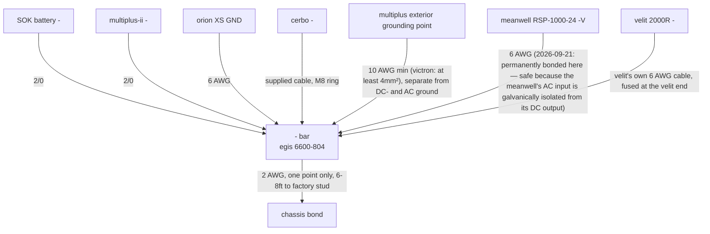
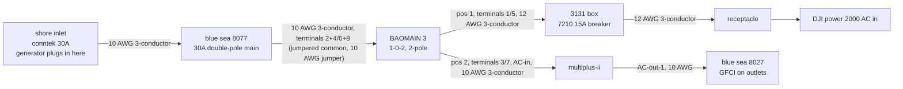
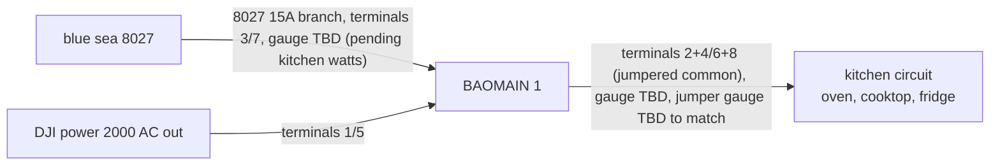
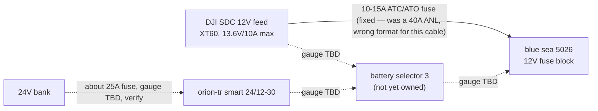
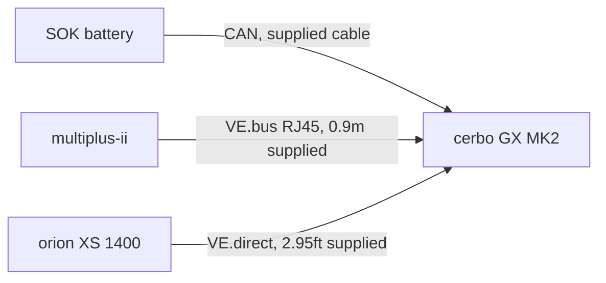

# diagrams

last updated: 2026-09-21

mermaid diagrams of the electrical plan. they render on github and in most markdown previewers, and claude code can read and edit them as text. solid lines are wiring in the plan. dashed lines are later options.

switch position convention (2026-09-21, see wiring.md): position 1 is always the DJI leg, position 2 is always the victron leg, on every switch that splits between the two systems — matches the physical layout (DJI driver side/left, victron passenger side/right) to the switch throw direction.

## dc positive and alternator

## dc negative and ground

## ac input

## ac loads

BAOMAIN 2 is spare as of the 2026-09-21 velit redesign (see the dc positive diagram for the velit's new circuit — battery selector 2, not an AC transfer switch). the 8027's second 15A branch, previously wired toward BAOMAIN 2, is unconnected — a candidate for the water heater (TBD).

## 12V bus (blue sea 5026)

solid is how it works now. dashed is the later option that adds a 24V-to-12V converter and a third battery selector (2026-09-21: renamed from "battery selector 2" to "battery selector 3" — selector 2 is now assigned to the velit, see the dc positive diagram. this option would need a new switch, not a repurposed one).

## data cables

