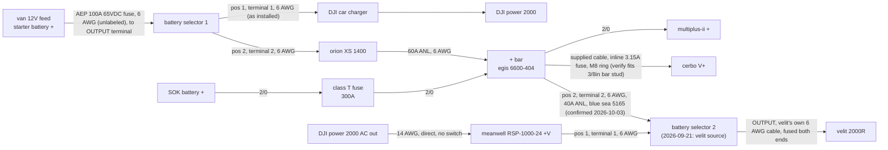
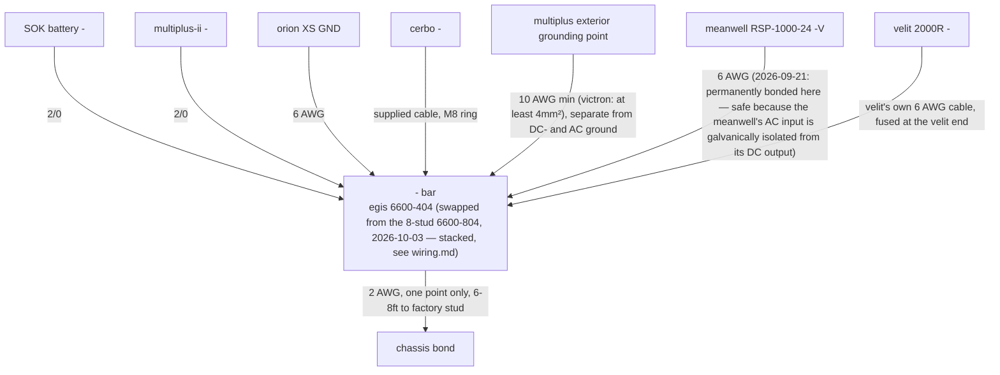
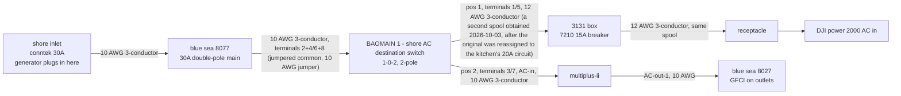
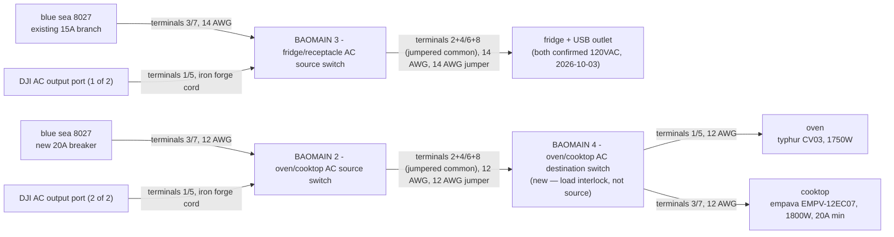
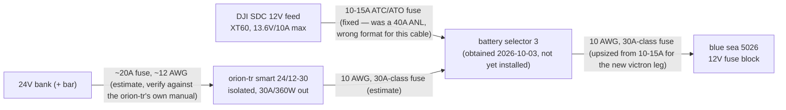
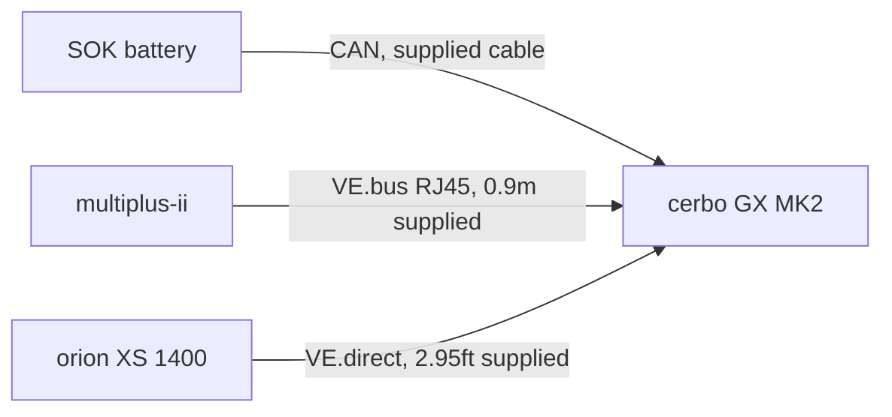

# diagrams

last updated: 2026-10-03 (resolved stale items)

mermaid diagrams of the electrical plan. they render on github and in most markdown previewers, and claude code can read and edit them as text. solid lines are wiring in the plan. dashed lines are later options.

switch position convention (2026-09-21, see wiring.md): position 1 is always the DJI leg, position 2 is always the victron leg, on every switch that splits between the two systems — matches the physical layout (DJI driver side/left, victron passenger side/right) to the switch throw direction. exception: BAOMAIN 4 - oven/cooktop AC destination switch (added 2026-10-02) selects between two loads (oven/cooktop), not two sources, so this convention doesn't apply to it.

## dc positive and alternator

## dc negative and ground

## ac input

## ac loads

kitchen redesign (2026-10-02): real nameplate watts (oven 1750W, cooktop 1800W with its own 20A-minimum breaker requirement, fridge 35-45W, confirmed AC 2026-10-03) ruled out one shared "kitchen" branch — oven+cooktop combined (3550W) exceed every AC source in this build. now two independent circuits: BAOMAIN 3 - fridge/receptacle AC source switch is no longer spare-adjacent, it's the 15A fridge+USB circuit's source-selector. BAOMAIN 2 - oven/cooktop AC source switch (freed by the 2026-09-21 velit redesign) is the 20A oven/cooktop circuit's source-selector, feeding BAOMAIN 4 - oven/cooktop AC destination switch (new switch) which mechanically interlocks oven and cooktop so they can never both be live. the 8027's second and third 15A branches remain spare (candidates: water heater, other future circuits). DJI's AC output (confirmed 2026-10-03): 4 ports, 100-120V/25A ≈ 3000W continuous for the US variant — clears the kitchen's worst case comfortably.

## 12V bus (blue sea 5026)

**12V bus redundancy adopted 2026-10-03, parts obtained 2026-10-03** (not yet installed): battery selector 3 (position 1 DJI, position 2 victron, same convention as every other switch) picks between the existing DJI SDC feed (~136W ceiling) and a new orion-tr smart 24/12-30 isolated converter off the 24V bus (30A/360W) — resolves the real gap where the USB panels alone are rated up to 432W. the orion-tr's own wire/fuse figures below are reasoned estimates (no manual on file for this specific part yet) — see wiring.md and verify.md.

## data cables

